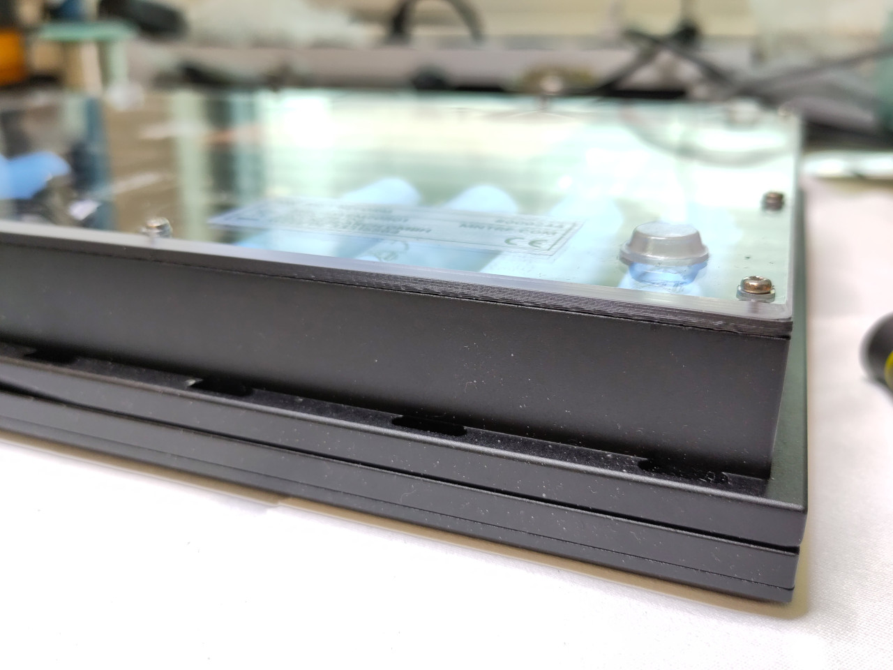
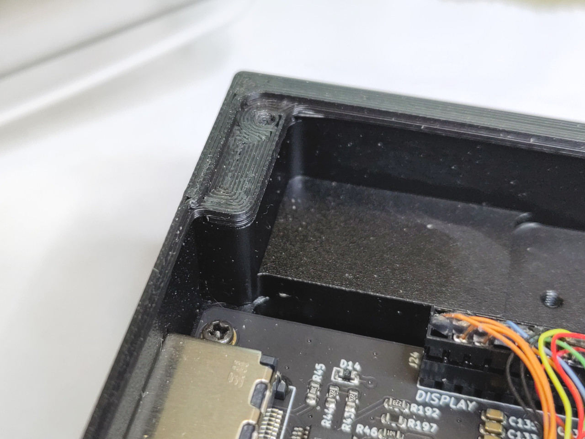
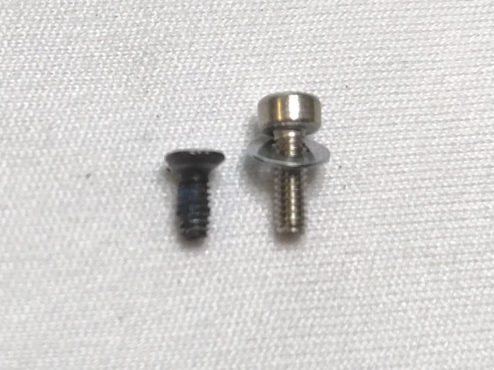
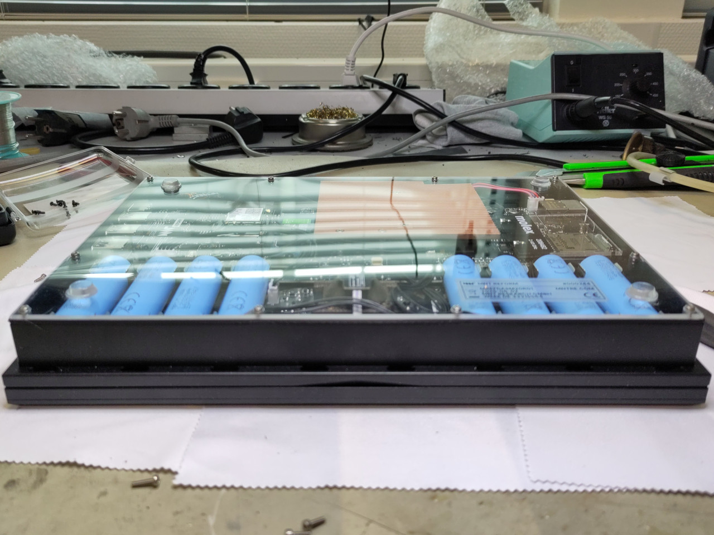
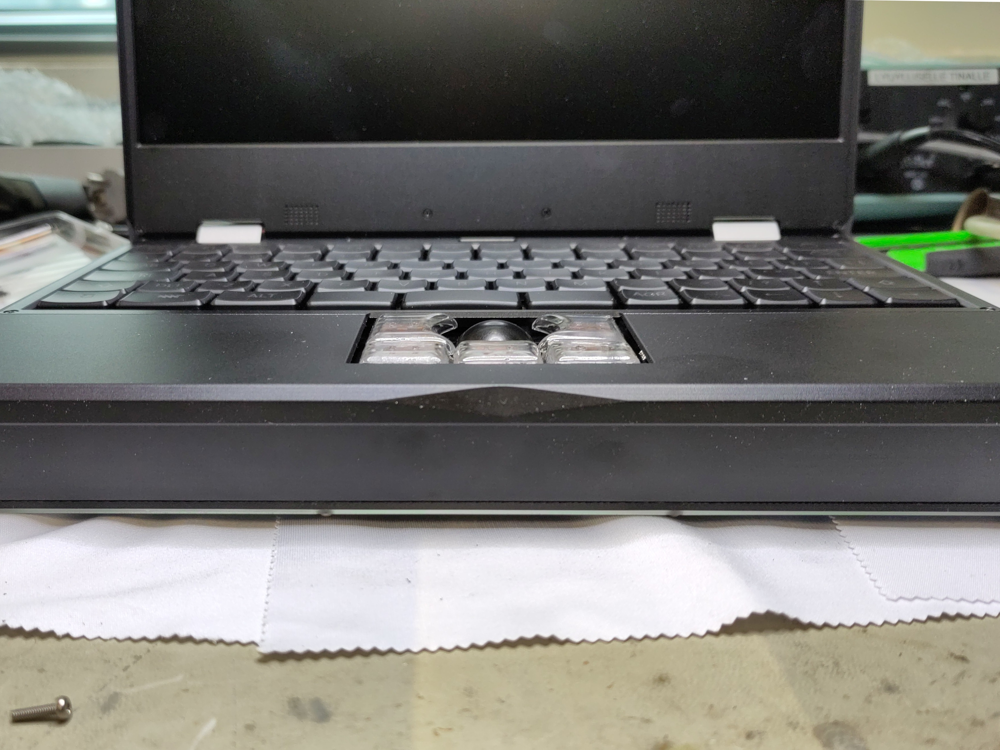
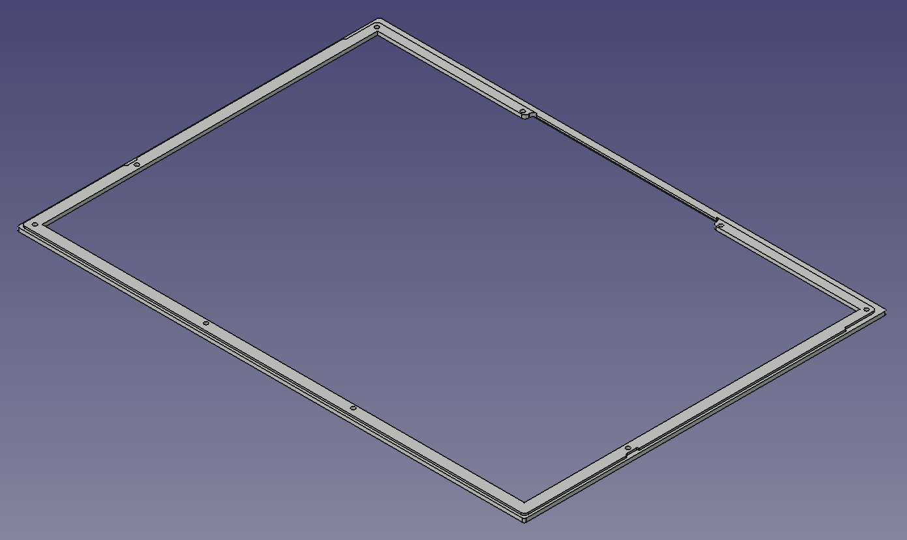
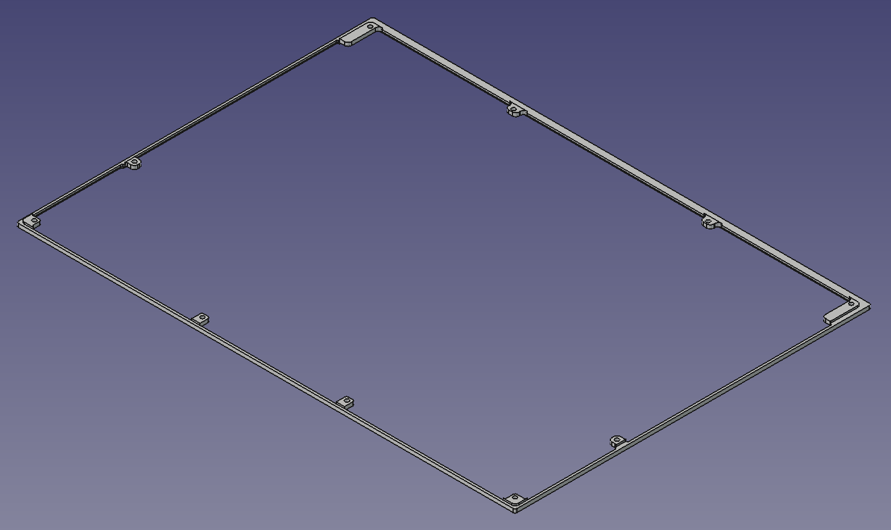
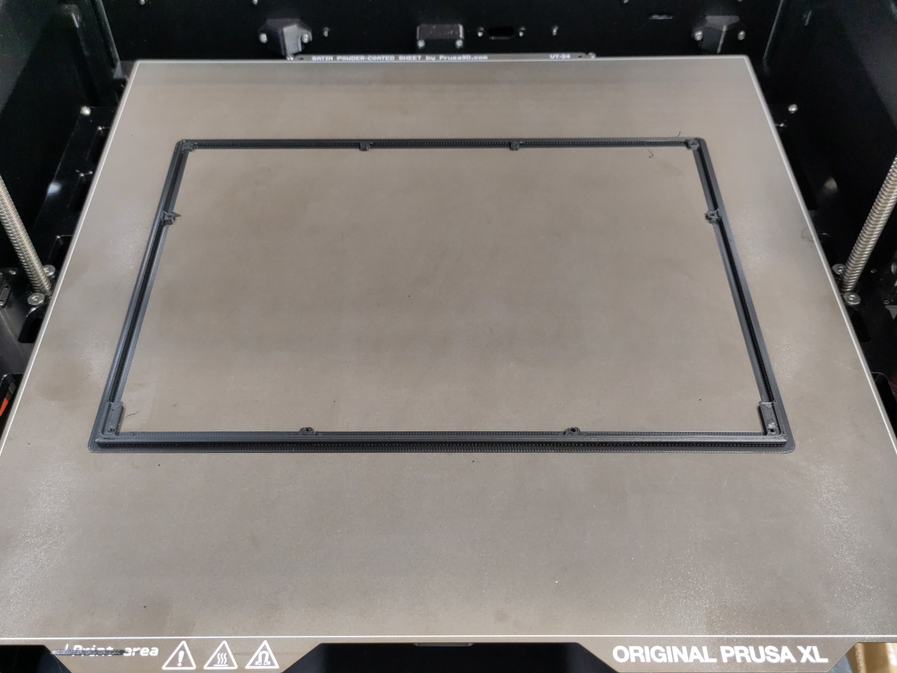
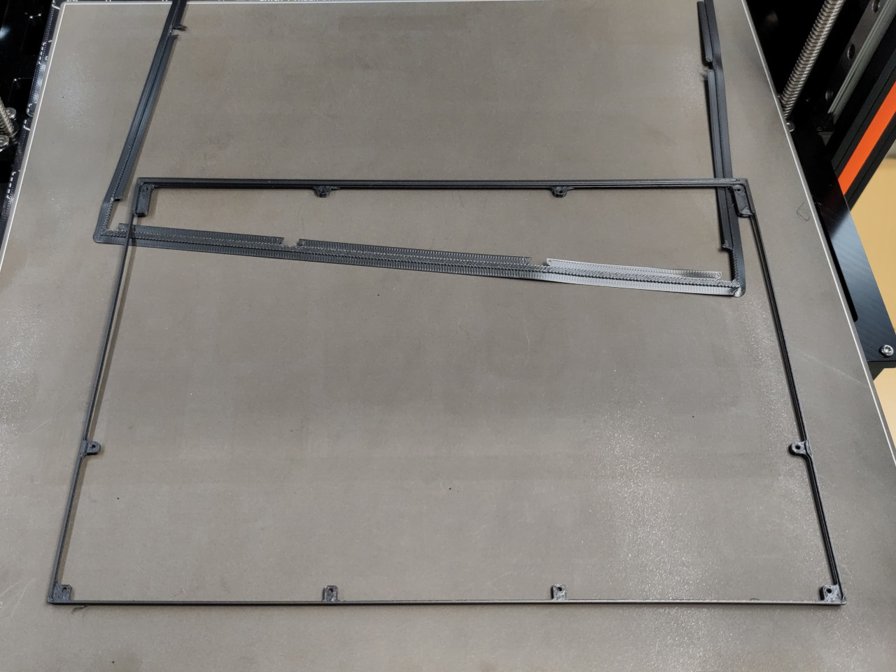

# MNT Reform bottom spacer
### Version 1.0

A 3D-printed spacer for the [MNT Reform](https://shop.mntre.com/products/mnt-reform) laptop, to move the bottom plexiglass plate 2mm downward and create a bit more space inside the laptop, in case your compute module is a bit too tall (e.g. some RK3588 modules).

You need longer bottom screws to install this spacer. The factory-supplied screws are M2x4 countersunk head screws. I use M2x8 panheads with M2 washers to accommodate the extra thickness of the spacer, but also to avoid stressing the plexiglass with the countersunk heads. The panheads do stick out but it's okay because the plexiglass plate has rubber feet that are taller.

With this spacer, no more bulging laptop!

## Files

[FreeCAD model](mnt_reform_bottom_spacer.FCStd)

### Spacer with reinforcements

Wider to make printing and handling easier, but visible under the plexiglass, and hides a bit of the internals.

- [STEP model for the spacer with reinforcements](mnt_reform_bottom_spacer-with_reinforcements.step)

### Spacer without reinforcements

No wider than the laptop's internal wall: almost invisible, but a bit harder to print and to install.

- [STEP model for the spacer without reinforcements](mnt_reform_bottom_spacer-no_reinforcements.step)

### Printing tips

- You need a printer with a bed at least 290mm wide (e.g. Prusa XL).
- Print the spacer out of PETG or some other material that's even more temperature-resistant, not PLA, so the material won't turn gooey when the CPU gets hot.
- Print the part totally solid, with only perimeters, or solid infill.
- Print with the inward-facing face of the spacer face down on the bed and enable supports, and add a brim.

